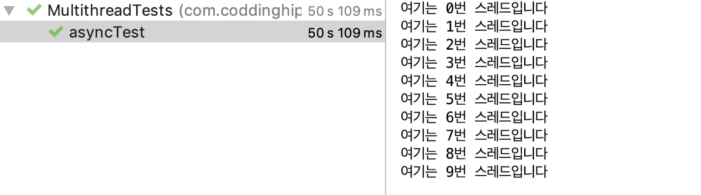
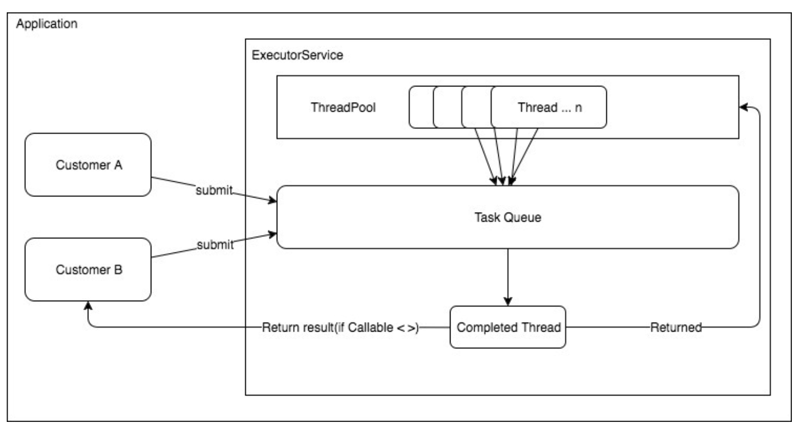
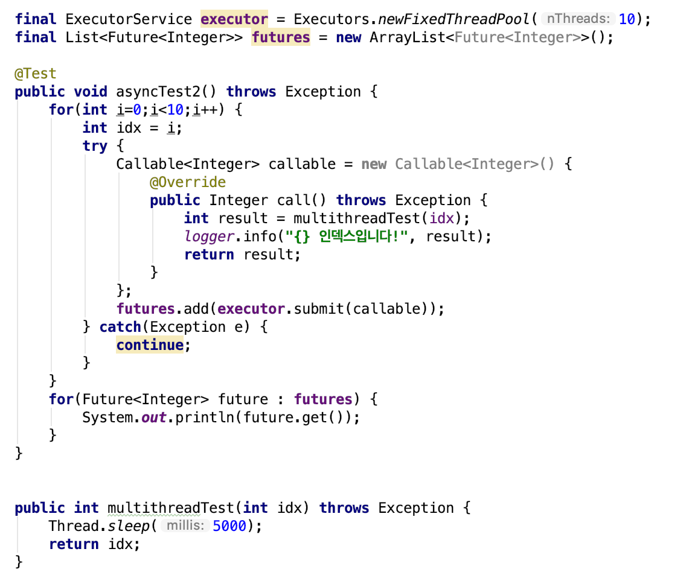
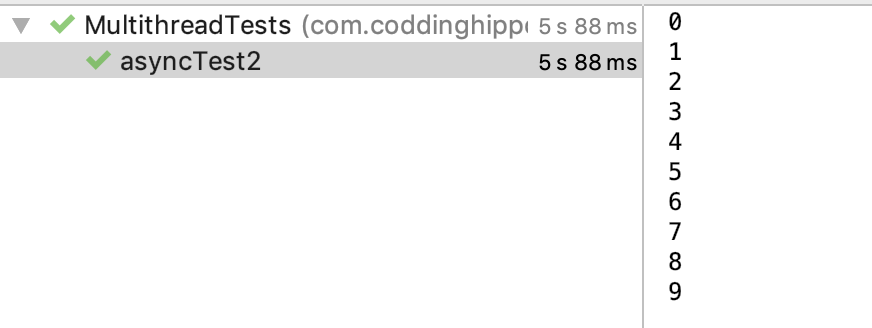

# [Springboot] Multi thread 를 활용한 비동기처리에 대해서 Deeeeeeeep 하게 알아보자


제가 개발하는 [막차서비스](https://makkcha.com)에서는 클라이언트의 1회 요청에 대한 응답으로 다음과 같은 값을 반환하고 있습니다.

```
MakchaInfo
- TaxiInfo
  ...
- PathInfo
	- List<Route> subwayPaths
	- List<Route> busPaths
	- List<Route> busAndSubwayPaths
	- List<Route> owlBusPaths
	
		<Route>
		String type
		int transferNum
		int totalTime
		List<Step> stepList
		String lastTime
		long remain

```


한번의 요청에 각 경로에 대한 리스트를 구하는 연산에 대략 1-2초 사이의 latency를 발생시키다보니(경로 갯수에 따라 더욱 많은 시간 소요..), 4개의 경로가 존재를 리턴하는것에 최대 10초가량의 시간이 소요가 되었습니다. 

<br>

이러한 문제를 해결하고자 하는 방법중 적용한 부분은 동일한 결과값을 반환하는 부분에 대하여 redis, ehCache를 적용하였지만, 근본적으로 특정 밸류에 대한 최초 요청시 전달하는 레이턴시를 감소시키는 방법은 아니었습니다.

<br>

이런 상황에서 해결책은 두가지 정도로 좁혀졌는데, 첫째, API를 여러 단위로 나눈다. 둘째, 연산과정에 멀티스레드를 활용하자 였습니다. 이전 프로젝트에서 멀티스레드를 직접적으로 활용해본 경험이 전무했기 때문에, 저는 이 기회에 뭐라도 배워보자라는 생각으로 멀티스레드를 적용하기로 결정했습니다.


## 스프링에서의 비동기처리

스프링에서 비동기 처리를 지원하기 위해 지원되는 기능 중 @Async 어노테이션을 붙이면 자동으로 내부적으로 멀티스레드를 이용하여 비동기적으로 특정 작업을 수행할 수 있습니다. 이러한 @Async에 대해서 처음 접해보시는 분이라면 해당 어노테이션 동작 방식에 대한 이해가 필요합니다.

<br>

@Async는 AOP기반으로 동작하는 스프링의 콜백 지원 어노테이션으로, 해당 어노테이션이 작성된 메소드 내에서의 작업은 새로운 스레드를 할당받아 동작하며, ThreadPool 옵션을 별도로 설정함으로써 ThreadPool등을 구성할 수 있습니다. 

<br>

여기서 AOP 기반으로 동작한다는 말인 즉슨, @Async가 붙은 메소드의 사용시점이 AOP가 클래스를 탐색하는 시점에 적용된다는 것이고, 이 말인 즉슨 Proxy 형태로 외부에서 접근하는 시점에 해당 기능이 발현된다는 이야기가 됩니다.

<sub> (내부 클래스에서는 @Async의 동작조차 인지하지 못하기때문에, 호출을 하더라도 동기적으로 동작하게 됩니다, 또한 동일한 이유로 해당 메소드는 public으로 선언되는것이 컴파일단에서 제한되어 있습니다)</sub>

> 위의 내용을 좀더 상세히 알고싶다면 [이곳](https://jeong-pro.tistory.com/187)을 참고하세요.


## 요구사항 정의 및 구현

제가 가진 요구사항은 하나의 List에 각각의 경로에 대한 연산이 마쳐지는대로 추가되도록 하는 작업이었습니다.

```
List<Route> subwayPaths

1. '2호선-1호선-10번버스', '6호선-2호선-1호선-10번버스', '9200번 버스-780번 버스' .. 등의 수많은 경로를 가져옴
2. 각 경로에 대한 막차 연산 알고리즘 동작 (이 시점에 multithread를 적용하고자 함)
3. 결과값을 활용하여 재가공된 Route 객체를 List에 add
```


이러한 사항들을 숙지한 이후 Async를 활용하여 비동기적으로 리스트에 연산 결과를 집어넣는 코드를 작성해보았습니다.

```java
@Async
public Future<Integer> asyncMethodWithReturnType(int idx) {
        try {
            Thread.sleep(5000);
            System.out.println("여기는 " + idx + "번 스레드입니다");
            return new AsyncResult<Integer>(idx);
        } catch (InterruptedException e) {
          	e.printStrackTrace();
        }
        return null;
}
```


Async 어노테이션이 붙은 메소드에서는 Future라는 객체 타입으로 메소드의 반환값을 활용 할 수 있습니다. 이런 Async 메소드를 선언 이후 이를 호출하는 코드 단에서 List로 각 반환 결과를 add 하는 코드를 다음과 같이 작성해보았습니다.


아마 이쯤 작성한 시점에서 개발자는 순차적이지 않은 idx를 가지고 여기저기서 콘솔을 찍어대는 코드를 기대할 것입니다. 하지만 결과는 다음과 같습니다.




(무려 50초의 실행시간을 거쳐서 순차적으로 모든 작업을 기다리며 for문을 순회했다.)


왜 이런 결과가 나오는 것일까요?  (List도 Synchrnized와는 상관없는 ArrayList를 채택하였고, 비동기적으로 Future 객체를 반환하는 @Async 어노테이션을 활용해서 반환값을 가져오고있는데..)

이 궁금증을 해결하기위해선 Future 객체를 면밀하게 살펴보아야 합니다. 위의 코드에서 반환결과를 가져오기 위해 result라는 List에 담기 위해 Future객체의 반환값을 가져오는 get 함수를 사용하였는데, 각각의 명세를 살펴보면 다음과 같습니다.


- `Future`는 백그라운드 작업이 완료된 후 나중에 알려지지 않은 시점에 사용 가능할 것으로 예상되는 결과를 나타냅니다. 
- `Future.get()`일시 정지하고 해당 태스크가 완료되고 결과가 사용 가능할 때까지 기다립니다.


get함수 자체에 스레드 접근제한을 거는 lock이 수행되기 때문에, for문 안에서 매번 하나의 실행결과가 돌아오기 까지 기다리게 되는 것입니다. 이러한 문제를 해결하기 위해서는 언제든 실행결과를 받아들일 수 있는 대기열 역할을 해줄 메모리가 필요합니다. 그것은 바로 ExecutorService 입니다.


### ExecutorService

자바 5버전 이후 스레드 관리를 위해 제공되는 라이브러리.


스레드를 직접 관리하면서 마주치는 불편함을 해소해주며(스레드 할당, 스레드 해제와 같은), 스레드 풀을 구현하기 쉽게해준다. 

ExecutorService는 다음과 같은 종류가 있습니다.

- CachedThreadPool : 일정시간동안 스레드를 검사하고 작업이 없을경우 pool에서 제거하는 기능을 가짐
- FixedThreadPool : 고정된 개수를 가진 스레드 풀
- SingleThreadExecutor : 한개의 스레드로 작업을 처리. 매번 커넥션, 해제가 일어나며, 스프링 부트에서 @Async할당시 기본 전략에 해당됨




(여기서 Customer라는건 Application에서 해당 서비스를 사용하는 클래스로 해석하면 됩니다)

해당 클래스에서 submit을 수행하면, ExecutorService 내부에서 해당작업을 내부적으로 스케줄링하면서 적절하게 일을 처리합니다.

이 때, Task를 가진 Queue에서 ThreadPool에 있는 스레드들이 각기 본인의 Task를 가지고 작업을 처리하기 때문에, 개발자 입장에서는 해당 스레드들의 생명주기를 따로 관리할 필요가 없어집니다.

ExecutorService에 들어가는 type에는 2가지를 제공하는데, Runnable과 Callable을 상속하여 구현한 클래스를 받을수 있도록 되어있다.


### Thread 구현 인터페이스 Runnable vs Callable

Runnable과 Callable은 모두 스레드 구현을 위한 인터페이스입니다. Runnable은 Java1 등장 당시부터 존재하였고, Callable은 Java5이후부터 등장하여, 다음과 같은 차이점을 갖고 있습니다.


#### return type

Runnable : return 값이 없는 스레드

Callable : return 값이 존재하는 스레드 (Future 객체를 통해)


#### Checked Exception

Callable의 경우 call 메소드가 Checked 예외를 던질 수 있지만 Runnable의 run() 메소드는 Checked 예외를 던질 수 없습니다.


ExecutorService를 통해 변경된 메소드의 모습은 다음과 같습니다.







사실 저 multithreadTest를 하나하나 실행하면서 콘솔을 찍어보고싶었는데. 왜그런지 모르겠지만 call() 메소드 내부에서 로깅이 출력이 안되더군요 ㅠ(이부분은 차후 알아내서 포스팅에 추가하도록하겠습니다!) 그래서 제가 원하는 기능을 구현하기위한 수준으로 리스트에 담고, 출력하는데 걸리는 시간을 출력했습니다.


## Result

이정도 수준까지 스레드를 처리하는 로직을 짜다보니 @Async의 유용성은 어디갔나.. 라는 생각과 함께 Async의 제약사항들이 오히려 개발을 더 피곤하게 만든다는 생각이듭니다!.. (물론 제가 사용법을 정확히 모르기 때문이겠죠,,?)


> 위와 비슷한 문제제기를 stackoverflow에도 제기되어 있던것을 확인 할 수 있었습니다. ([링크](https://stackoverflow.com/questions/19348248/waiting-on-a-list-of-future))


---

##### 부록. @Async 를 활용하면서 마주친 이슈

[**transactional에러**](https://stackoverflow.com/questions/32269192/spring-no-entitymanager-with-actual-transaction-available-for-current-thread)

[**transactional async 주의점**](https://www.slipp.net/questions/10)

[**task rejection exception**](https://stackoverrun.com/ko/q/10326439)

**[Task Execution and Scheduling](https://docs.spring.io/spring/docs/3.0.5.RELEASE/reference/scheduling.html)** 


## 스레드 사용 OOM(OutOfMemory) 이슈

서비스에 스레드풀을 적용하고 동작시키던 과정에 OutOfMemoryError: unable to create new native thread 와같은 에러를 호출하면서 서버가 뻗어버리는 이슈가 발생했다. 해당 이슈는 아주 치명적이었는데, 어플리케이션이 죽는게 아니라)서버 메모리 상에서 프로세스를 더이상 할당할수 없는 문제였기때문에) 서버가 응답이 되지 않는것이었기때문에, ec2 접속을 시도하더라도 Broken pipe 에러를 뱉어내면서 ssh 접속이 불가능했다. 이런상태에서 어플리케이션의 헬스체크는 정상적으로 가능하다는 점에서 로드밸런서가 서비스 운영 장애를 인식하지 못하고 있었다.

 결국 강제로 ec2인스턴스를 stop하여 어플리케이션을 강제로 종료한 후 다시 서버를 start 시킨 후에야 정상적으로 돌아왔는데, 실제 개발환경에서는 예측할 수 없었던 에러였다. 이러한 부분들을 해결하기 위해서 jvm의 여러 옵션들을 공부하고, 로깅하는 전략들을 배웠는데, 결론적으로 문제 원인은 개발 코드에 있었다.


IntelliJ의 [VisualVM플러그인을 활용](https://ryudung.tistory.com/26)하면 JVM의 스레드 할당량이나, 힙 상태등을 로컬 개발 환경에서 손쉽게 모니터링 가능한데, 이 도구를 이용해서 막차 서비스를 동작시켜본 결과, 요청을 생성할때마다 스레드가 계속해서 늘어나는 버그를 발견 할 수 있었다.

결국 문제의 원인은 스레드를 계속해서 생성하고, 복구시키지 않는다는 점이었는데, 디버깅 결과 아주 충격적인 코드를 발견할 수 있었다.


```java
public List<RouteDTO> makeRoute(List<Path> tmpPath, int serviceDay, String pathType) {
	...

	final ExecutorService executor = Executors.newFixedThreadPool(20);
	final List<Future<RouteDTO>> futures = new ArrayList<Future<RouteDTO>>();

	for (Path path : pathList) {
   	  Callable<RouteDTO> callable = new Callable<RouteDTO>() {
    	      @Override
    	      public RouteDTO call() throws Exception {
    	      return asyncPathFindService.getPathInfo(path, pathType, serviceDay);

    	 };
    	 if(callable == null) continue;
    	 futures.add(executor.submit(callable));  // 막차시간 set
	}
}
```


위 코드의 세번째줄을 보면 새로운 스레드 풀을 선언하는 코드가 보이는데, 저런 코드를 수행한 결과 VisualVM을 통해 발견한 그래프의 모습은 다음과 같다


<sub>요청 개수에 따라 고정 스레드 개수가 끊임없이 증가하고있다</sub>


이러한 버그 발견 이후, 스레드 풀 선언하는 부분을 메소드 바깥의 빈쪽에 생성하도록 변경하였고, 그 이후 돌려본 결과는 다음과 같다


요청 개수와 상관없이 항상 꾸준한 스레드 개수를 유지하고 있다.


이렇게 VisualVM을 활용하면 코드 내부에서 쉽게 발견할수 없는 부분에 대해서 디버깅이 가능하다!!

적극 활용하도록하자~


[GC 동작과정](https://d2.naver.com/helloworld/1329)

[메모리 누수 이슈 해결과정](https://d2.naver.com/helloworld/1326256)

[OutOfMemory 해결하기](https://rajalo.tistory.com/entry/javalangOutOfMemoryError-unable-to-create-new-native-thread-%EC%A0%84%EC%B2%B4%EA%B3%B5%EA%B0%9C)

[스레드 덤프 분석](https://d2.naver.com/helloworld/10963)
[스레드 덤프 읽는방법](https://sjh836.tistory.com/151)

[Jstat을 통한 JVM heap memory 모니터링](https://dumdildor.tistory.com/10)

[jvm 동작과정 Java8 Before, After](http://blog.naver.com/PostView.nhn?blogId=hanajava&logNo=221360410433&categoryNo=40&parentCategoryNo=40&viewDate=&currentPage=1&postListTopCurrentPage=&from=postList)


